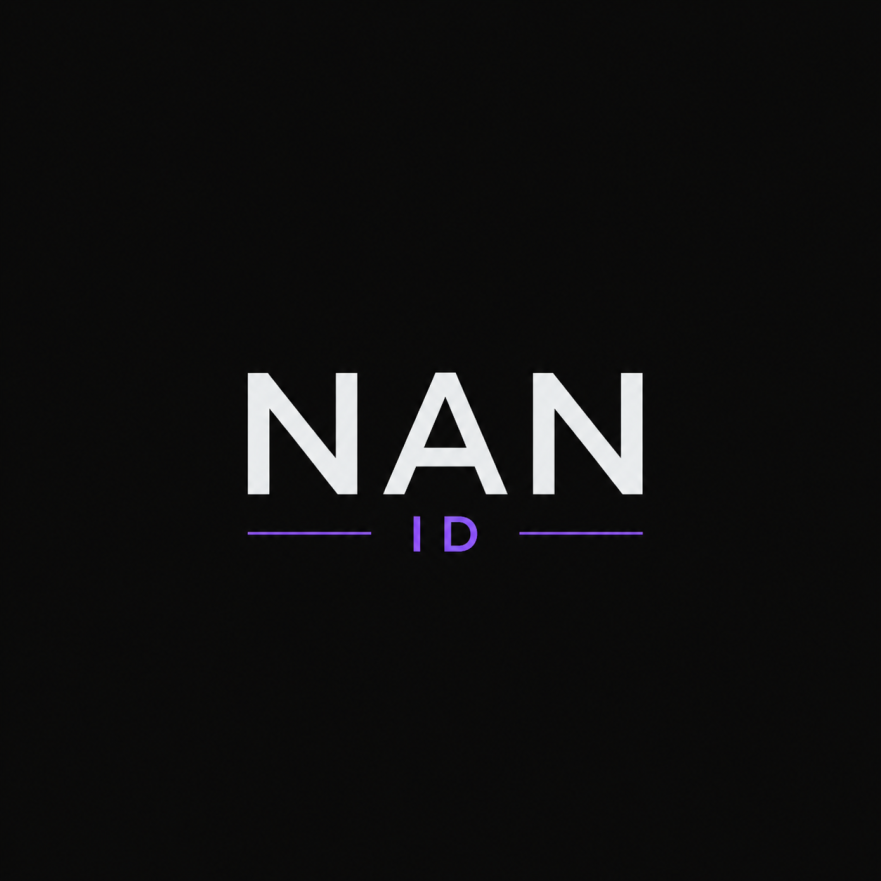

<div align="center">



# Discord Web Auto Quest Extension


Automatically complete **Discord Quests** directly from your browser.

No more manually watching videos or completing repetitive quest steps—just open the Quest page, click **Run**, and let the extension do the work.

</div>

> [!IMPORTANT]
> **Status:** Actively maintained and compatible with the current Discord web client.

> [!WARNING]
> Discord may detect or restrict automated quest completion. Use this extension at your own discretion.

---

## ✨ Features

- 🎥 Automatically completes supported Discord Quests
- 🎁 Auto-claim completed rewards
- 🚀 Auto-start when opening Quest Home
- ✅ Auto-accept available quests
- 🔄 Sequential quest execution
- 📊 Live progress panel
- 🔔 Desktop notifications
- ⏳ Quest expiration countdown
- 🔁 Automatic quest re-check
- 🎛️ Customizable settings
- ⚡ Runs completely locally
- 🔒 No analytics, tracking, or external servers

---

## 📦 Supported Quest Types

- WATCH_VIDEO
- WATCH_VIDEO_ON_MOBILE
- PLAY_ON_DESKTOP
- STREAM_ON_DESKTOP
- PLAY_ACTIVITY

---

## 📥 Installation

```bash
npm install
npm run build
```

Then:

1. Open `chrome://extensions`
2. Enable **Developer Mode**
3. Click **Load unpacked**
4. Select the `dist` folder

---

## 🚀 Usage

1. Open `https://discord.com/quest-home`
2. Accept the quests.
3. Click **Running Quests**.
4. Sit back and let the extension finish them automatically.

---

## ⚙️ How It Works

The extension runs entirely inside your browser.

It:

- Overrides the browser User-Agent
- Injects a helper script into Discord
- Accesses Discord's internal Quest modules
- Sends Quest progress directly to Discord's official API
- Displays a local progress panel

No external servers or third-party services are used.

---

## 🔒 Privacy

- ✅ No personal data collected
- ✅ No analytics
- ✅ No tracking
- ✅ No external servers
- ✅ Everything runs locally

---

## 🛠 Development

```bash
npm run build
npm run dev
npm test
npm run typecheck
```

---

## ❓ Troubleshooting

**Button doesn't appear**

- Refresh the Quest page.
- Make sure the extension is enabled.
- Open `https://discord.com/quest-home`.

**Quest doesn't complete**

- Accept the quest first.
- Check the browser console (`F12`).
- Some quests may require Discord Desktop.

---

## ⚠️ Disclaimer

This project is intended for educational and research purposes.

Using automation tools may violate Discord's Terms of Service. You are solely responsible for how you use this software.